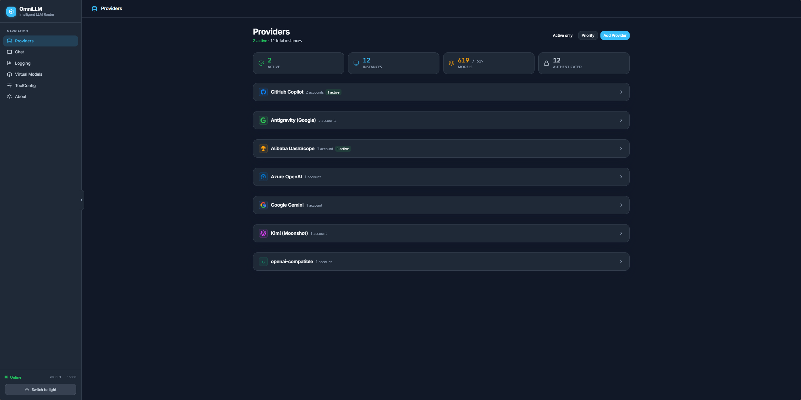
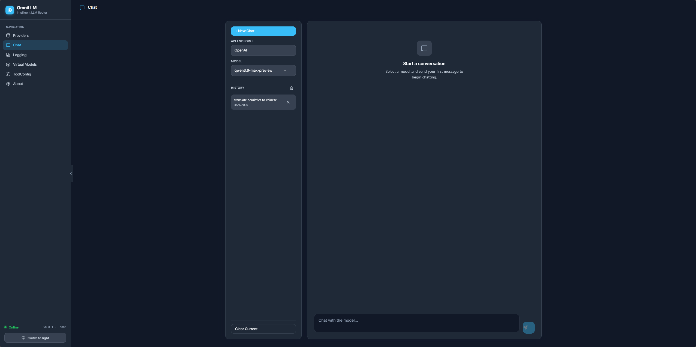
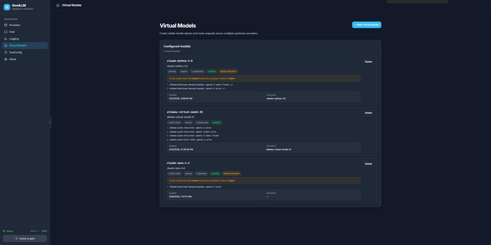
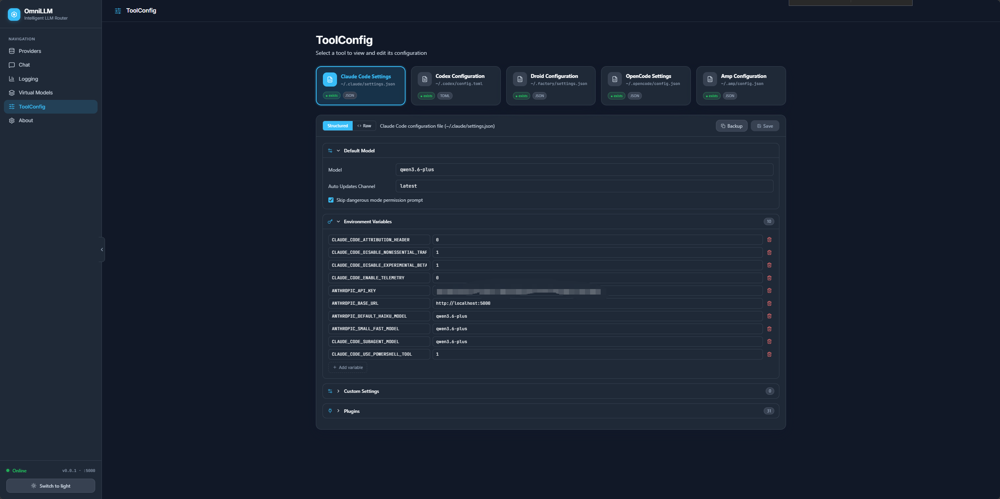

# OmniLLM

<p align="center">Enterprise-ready multi-provider LLM gateway.</p>

<p align="center">
  <a href="#quick-start">Quick Start</a> |
  <a href="#core-capabilities">Capabilities</a> |
  <a href="#supported-providers">Providers</a> |
  <a href="#architecture">Architecture</a> |
  <a href="#toolconfig---ai-assistant-configuration-management">ToolConfig</a> |
  <a href="#api-compatibility-surface">API Reference</a> |
  <a href="#security">Security</a> |
  <a href="#development">Development</a>
</p>

---

OmniLLM is a unified control plane and gateway for LLM model access. It sits between your applications/agents and upstream LLM providers, translating requests through a **Canonical Intermediate Format (CIF)** so any client can talk to any provider regardless of API shape.

**What it does:**

- Exposes **OpenAI-compatible** (`/v1/chat/completions`, `/v1/models`, `/v1/embeddings`, `/v1/responses`) and **Anthropic-compatible** (`/v1/messages`, `/v1/messages/count_tokens`) endpoints from a single gateway
- Routes AI traffic across **7+ provider types** (GitHub Copilot, Alibaba DashScope, Azure OpenAI, Google, Kimi, Antigravity, any OpenAI-compatible endpoint) with priority-based failover
- Centralizes provider authentication, model discovery, and runtime administration
- Provides a redesigned web admin console for live provider switching, log streaming, config editing, and virtual model management
- Manages configuration files for popular AI coding agents (Claude Code, Codex, Droid, OpenCode, AMP)

Route AI traffic through a controlled internal endpoint instead of binding applications directly to individual providers.



### Chat



### Virtual Models



## Quick Start

### Prerequisites

- [Bun](https://bun.sh) >= 1.2
- [Go](https://golang.org) >= 1.22

### Development mode

```sh
bun run dev
```

Starts both backend (Go, port 5000) and frontend (Vite, port 5080). Admin UI at `http://localhost:5080/admin/`.

### API key setup

All API routes are protected by an API key. On first start, OmniLLM auto-generates a random key and persists it to `~/.config/omnillm/api-key`. You can either set a known key upfront or use the auto-generated one.

**Option A: Set a known key (recommended)**

```sh
# Via CLI flag
bun run omni start --api-key my-secret-key

# Or via environment variable
OMNILLM_API_KEY=my-secret-key bun run omni start
```

On Windows (PowerShell), set the environment variable before running:

```powershell
$env:OMNILLM_API_KEY = "my-secret-key"
bun run omni restart --rebuild --server-port 5000 --frontend-port 5080 -v
```

**Option B: Pre-create the key file**

```sh
# macOS / Linux
mkdir -p ~/.config/omnillm
echo -n "my-secret-key" > ~/.config/omnillm/api-key
bun run omni restart --rebuild --server-port 5000 --frontend-port 5080 -v
```

On Windows (PowerShell):

```powershell
New-Item -ItemType Directory -Force -Path "$env:USERPROFILE\.config\omnillm"
"my-secret-key" | Set-Content -NoNewline -Path "$env:USERPROFILE\.config\omnillm\api-key"
bun run omni restart --rebuild --server-port 5000 --frontend-port 5080 -v
```

**Option C: Use the auto-generated key**

Start the server without specifying a key — OmniLLM generates a random one and persists it:

```sh
bun run omni restart --rebuild --server-port 5000 --frontend-port 5080 -v
```

On Windows (PowerShell):

```powershell
bun run omni restart --rebuild --server-port 5000 --frontend-port 5080 -v
```

Then read the key from the persisted file:

```sh
# macOS / Linux
cat ~/.config/omnillm/api-key

# Windows (PowerShell)
cat "$env:USERPROFILE\.config\omnillm\api-key"
```

Once you have the key, include it in API requests:

```sh
# Bearer token header
curl -H "Authorization: Bearer <your-api-key>" http://localhost:5000/v1/models

# Or x-api-key header
curl -H "x-api-key: <your-api-key>" http://localhost:5000/v1/models

# Or query parameter (for SSE streams)
curl "http://localhost:5000/api/admin/logs/stream?api_key=<your-api-key>"
```

Or on Windows (PowerShell):

```powershell
$headers = @{ Authorization = "Bearer my-secret-key" }
Invoke-RestMethod -Uri "http://localhost:5000/v1/models" -Headers $headers
```

The admin UI automatically injects the key via a `<meta>` tag, so no manual auth is needed in the browser.

### Background mode with service management

```sh
bun run omni start          # start both services
bun run omni status         # check status
bun run omni stop           # stop all services
bun run omni restart        # restart services
bun run omni restart --rebuild  # rebuild Go binary + frontend, then restart
```

### Run with bunx

```sh
bunx omnillm@latest start
```

### Run with Docker

```sh
docker build -t omnillm .
docker run -p 4141:4141 -v $(pwd)/proxy-data:/root/.local/share/omnillm omnillm
```

The auto-generated API key persists in the mounted volume, so restarts reuse the same key. To set a known key:

```sh
docker run -p 4141:4141 -e OMNILLM_API_KEY=my-secret-key omnillm
```

---

## Core Capabilities

### Canonical Intermediate Format (CIF)

All incoming requests — regardless of API shape (OpenAI or Anthropic) — are parsed into a **Canonical Intermediate Format** (`internal/cif/types.go`). This normalized data model is what every provider adapter reads and writes, eliminating the need for pairwise format translations between N providers. Adding a new provider only requires implementing two adapters (to/from CIF) rather than 2N pairwise converters.

### Unified API compatibility

OpenAI-style (`/v1/chat/completions`, `/v1/models`, `/v1/embeddings`, `/v1/responses`) and Anthropic-style (`/v1/messages`, `/v1/messages/count_tokens`) endpoints from a single gateway. Existing applications migrate with minimal integration changes — just point `OPENAI_BASE_URL` or `ANTHROPIC_BASE_URL` at OmniLLM.

### Multi-provider routing with automatic failover

Manage multiple providers simultaneously. Switch the active backend without restarting. Provider priorities enable automatic failover — when a provider fails mid-request, OmniLLM transparently tries the next candidate in priority order.

### Virtual models

Define abstract model IDs that map to specific provider models with configurable load-balancing strategies (round-robin, random, priority, weighted). This creates an abstraction layer between application code and upstream providers, enabling model swaps without touching client configuration.

### Centralized authentication

Provider authentication through CLI and admin workflows — OAuth device flow for GitHub Copilot, API key for Alibaba DashScope, and token-based auth for all others. Credentials are persisted in SQLite (pure Go, no CGO) and restored on restart.

### Operational visibility

Admin console with provider status, model discovery, usage visibility, runtime metadata, live log streaming via SSE and WebSocket, and dynamic log-level control. Request logs include client IP and User-Agent for identifying which tool (Claude Code, Codex, Droid, etc.) is making requests.

### Config file management (ToolConfig)

View, edit, import, and backup configuration files for popular AI coding agents directly from the admin UI: Claude Code, Codex, Droid, OpenCode, and Amp. Structured editors provide intuitive UI for each config format. Editing is gated behind the `--enable-config-edit` flag. Config backup creates timestamped copies in the same directory.

### Streaming resilience

If an upstream SSE stream fails before any data is sent (connection error, timeout), OmniLLM automatically retries as a non-streaming request and re-streams the completed response locally to the client. This is used by the Alibaba adapter to work around DashScope SSE reliability issues.

### Developer and agent integration

Works as a local gateway for Claude Code and other clients. Auto-generated API key injected into the admin UI via `<meta>` tag for seamless frontend authentication. The frontend auto-detects the backend port at runtime by probing known ports.

---

## Supported Providers

| Provider | Authentication | Notes |
|---|---|---|
| **GitHub Copilot** | OAuth device flow or token | Requires active Copilot subscription |
| **Alibaba DashScope** | API key | Supports global and China regions; coding plan variant |
| **OpenAI-Compatible** | API key (optional) | Any OpenAI-compatible endpoint: Ollama, vLLM, LM Studio, llama.cpp, OpenAI |
| **Azure OpenAI** | API key | Configurable endpoint, API version, and deployments |
| **Google** | API key | Generic Google provider |
| **Kimi** | API key | Generic Kimi provider |
| **Antigravity** | Google OAuth | Requires Google OAuth client credentials |

New providers are registered with canonical instance IDs derived from their endpoint URL and API key suffix, ensuring stable identification across restarts.

---

## Architecture

```
Clients / Agents / Internal Apps
            |
            v
        OmniLLM Gateway
   ┌─────────────────────────────────────────┐
   │  Inbound API Key Auth                   │
   │  (Bearer / x-api-key / SSE query)       │
   ├─────────────────────────────────────────┤
   │  Ingestion Layer                        │
   │  OpenAI format ──┐                      │
   │  Anthropic format├─► CIF (Canonical     │
   │  Responses API  ─┘   Intermediate       │
   │                      Format)            │
   ├─────────────────────────────────────────┤
   │  Model Routing + Priority Failover      │
   │  Virtual Model Resolution               │
   │  Rate Limiting + Manual Approval        │
   ├─────────────────────────────────────────┤
   │  Provider CIF Adapters                  │
   │  (Execute / ExecuteStream)              │
   ├─────────────────────────────────────────┤
   │  Serialization Layer                    │
   │  CIF ──► OpenAI format / Anthropic      │
   │         format (SSE or non-streaming)   │
   ├─────────────────────────────────────────┤
   │  Admin Console + SSE/WS Log Streaming   │
   │  SQLite Persistence (provider, tokens,  │
   │  configs, chat sessions, vmodels)       │
   └─────────────────────────────────────────┘
            |
            v
  GitHub Copilot / Alibaba DashScope / Azure OpenAI
  / Google / Kimi / Antigravity / Ollama / vLLM
  / OpenAI / any OpenAI-compatible endpoint
```

### Key Components

| Package | Path | Purpose |
|---|---|---|
| **Server** | `internal/server/` | Gin HTTP server, route registration, CORS, auth middleware, admin UI serving, SSE/WebSocket log streaming |
| **Routes** | `internal/routes/` | HTTP handlers for chat, models, embeddings, messages, responses, usage, token, admin, config files, virtual models |
| **Ingestion** | `internal/ingestion/` | Parses incoming OpenAI/Anthropic/Responses requests into `cif.CanonicalRequest` with fail-fast validation for malformed input |
| **CIF** | `internal/cif/` | Canonical Intermediate Format — the normalized request/response data model all providers translate to/from |
| **Serialization** | `internal/serialization/` | Converts CIF responses back to the client's expected API format (OpenAI SSE, Anthropic SSE, non-streaming JSON) |
| **Providers** | `internal/providers/` | Per-provider implementations (Copilot, Alibaba, Azure, Google, Kimi, Antigravity, OpenAI-Compatible, Generic) |
| **Registry** | `internal/registry/` | Thread-safe `ProviderRegistry` — manages registered providers, active provider selection, failover |
| **Model Routing** | `internal/lib/modelrouting/` | Resolves model names to candidate providers with caching |
| **Virtual Model Routing** | `internal/lib/vmodelrouting/` | Routes abstract virtual model IDs to specific provider models with load-balancing strategies |
| **Database** | `internal/database/` | SQLite persistence via `modernc.org/sqlite` (pure Go, no CGO) — provider instances, tokens, configs, chat sessions, virtual models |
| **Security** | `internal/security/` | SSRF protection for OpenAI-compatible endpoints |
| **Rate Limiting** | `internal/lib/ratelimit/` | Configurable rate limiter with optional queue-on-reject behavior |
| **Approval** | `internal/lib/approval/` | Manual request approval mode (`--manual` flag) |
| **GitHub Service** | `internal/services/github/` | GitHub Copilot-specific logic (token refresh, usage, quota) |
| **Frontend** | `frontend/` | React 19 + Vite + MUI/Tailwind v4 admin console |

### Request Flow

1. Client sends request (e.g., `POST /v1/chat/completions`) to OmniLLM
2. Auth middleware validates inbound API key (Bearer / x-api-key / query param)
3. Logging middleware generates request ID, captures client IP and User-Agent
4. Rate limiter checks throttling; if `--manual` mode, prompts for operator approval
5. Ingestion parser deserializes body into `cif.CanonicalRequest`
6. Model routing normalizes model name, resolves candidate providers from registry
7. Provider iteration loops through candidates in priority order:
   - Gets provider's CIF adapter via `GetAdapter()`
   - Remaps model name to provider's internal naming
   - Calls `Execute()` (non-streaming) or `ExecuteStream()` (streaming, returns Go channel)
   - On failure, tries next candidate (automatic failover)
8. Serialization converts CIF response back to client's expected API format
9. Response sent back with structured logging of the full lifecycle

### Tech Stack

**Backend:** Go 1.23, Gin, zerolog, Cobra CLI, modernc.org/sqlite (pure Go SQLite)

**Frontend:** React 19, Vite, MUI v7, Tailwind v4, Radix UI, Lucide icons, Sonner, TypeScript

**Tooling:** Bun (runtime + package manager), ESLint, simple-git-hooks + lint-staged

**Deployment:** Multi-stage Dockerfile (`golang:1.23-alpine` → `oven/bun:1.2.19-alpine` → `alpine:3.20`), standalone binary, or `bunx omnillm@latest`

---

## Security

OmniLLM introduces several security controls to protect the gateway and upstream providers.

### Inbound API authentication

All API routes are protected by an API key. The key is resolved in this order:

1. `--api-key` CLI flag
2. `OMNILLM_API_KEY` environment variable
3. Persisted file at `~/.config/omnillm/api-key`
4. Auto-generated random key (persisted to the file above)

Authentication accepts `Authorization: Bearer <key>`, `x-api-key: <key>`, or `?api_key=<key>` query parameter for SSE streams.

### SSRF protection

OpenAI-compatible provider endpoints are validated against SSRF attacks. Localhost, loopback, private, and link-local addresses are rejected unless `--allow-local-endpoints` is set.

```sh
# Allow local endpoints (e.g. Ollama at localhost:11434)
bun run omni start --allow-local-endpoints
```

### CORS

CORS is restricted to `localhost`, `127.0.0.1`, and `::1` origins. EventSource connections receive appropriate headers for SSE streaming.

### Token masking

The `/token` endpoint returns masked tokens by default (first 4 + last 4 characters visible). Full tokens are only exposed when `--show-token` is enabled.

### Config editing guard

External config file editing (Claude Code, OpenCode, etc.) is disabled by default and must be explicitly enabled with `--enable-config-edit`.

### Recommended production controls

- Run behind an internal reverse proxy or API gateway
- Restrict admin access to trusted operators
- Isolate persistent state with controlled filesystem permissions
- Avoid exposing diagnostic/token endpoints on public networks
- Review each provider's contractual and compliance posture before shared organizational use

---

## CLI Reference

### Commands

| Command | Purpose |
|---|---|
| `start` | Start the OmniLLM gateway |
| `auth` | Authenticate providers without starting the server |
| `check-usage` | Print GitHub Copilot usage/quota information |
| `debug` | Print runtime, version, and path diagnostics |
| `chat` | Launch an interactive provider chat shell |

### `start` options

| Option | Alias | Default | Description |
|---|---|---|---|
| `--port` | `-p` | `5005` | Listening port |
| `--provider` | | `github-copilot` | Active provider |
| `--verbose` | `-v` | `false` | Enable verbose logging |
| `--account-type` | `-a` | `individual` | Copilot plan (`individual`, `business`, `enterprise`) |
| `--rate-limit` | `-r` | none | Minimum seconds between requests |
| `--wait` | `-w` | `false` | Queue/wait instead of failing on rate limit |
| `--manual` | | `false` | Require manual approval per request |
| `--github-token` | `-g` | none | Provide GitHub token directly |
| `--claude-code` | `-c` | `false` | Guided Claude Code setup |
| `--show-token` | | `false` | Print tokens during fetch/refresh |
| `--proxy-env` | | `false` | Read proxy settings from environment variables |
| `--api-key` | | auto-generated | Inbound API key for route protection |
| `--allow-local-endpoints` | | `false` | Allow localhost/private OpenAI-compatible endpoints |
| `--enable-config-edit` | | `false` | Allow editing external config files via admin API |

---

## API Compatibility Surface

### OpenAI-compatible endpoints

| Method | Endpoint | Description |
|---|---|---|
| `POST` | `/v1/chat/completions` | Chat completions |
| `GET` | `/v1/models` | List available models |
| `POST` | `/v1/embeddings` | Text embeddings |
| `POST` | `/v1/responses` | Responses API |

### Anthropic-compatible endpoints

| Method | Endpoint | Description |
|---|---|---|
| `POST` | `/v1/messages` | Messages API |
| `POST` | `/v1/messages/count_tokens` | Token counting |

### Utility endpoints

| Method | Endpoint | Description |
|---|---|---|
| `GET` | `/usage` | Active provider usage and quota |
| `GET` | `/token` | Current provider token (masked by default) |
| `GET` | `/health` | Health check with timestamp |
| `GET` | `/healthz` | Minimal health check |

### Admin API

| Method | Endpoint | Description |
|---|---|---|
| `GET` | `/api/admin/info` | Version, port, backend type, uptime |
| `GET` | `/api/admin/status` | Server and provider status |
| `GET` | `/api/admin/providers` | List providers with auth status and model counts |
| `POST` | `/api/admin/providers/switch` | Switch active provider |
| `POST` | `/api/admin/providers/add/:type` | Add a new provider instance |
| `POST` | `/api/admin/providers/auth-and-create/:type` | Authenticate and create provider in one step |
| `DELETE` | `/api/admin/providers/:id` | Delete a provider instance |
| `GET` | `/api/admin/providers/:id/models` | List models for a provider |
| `POST` | `/api/admin/providers/:id/models/refresh` | Force-refresh model list from upstream |
| `POST` | `/api/admin/providers/:id/models/toggle` | Enable/disable a model |
| `GET` | `/api/admin/providers/:id/models/:modelId/version` | Get model version string |
| `PUT` | `/api/admin/providers/:id/models/:modelId/version` | Set model version string |
| `GET` | `/api/admin/providers/:id/usage` | Provider-specific usage |
| `POST` | `/api/admin/providers/:id/auth` | Authenticate a provider |
| `POST` | `/api/admin/providers/:id/auth/initiate-device-code` | Start OAuth device code flow |
| `POST` | `/api/admin/providers/:id/auth/complete-device-code` | Complete OAuth device code flow |
| `PUT` | `/api/admin/providers/:id/config` | Update provider configuration |
| `POST` | `/api/admin/providers/:id/activate` | Activate a provider |
| `POST` | `/api/admin/providers/:id/deactivate` | Deactivate a provider |
| `GET` | `/api/admin/providers/priorities` | Get provider failover priorities |
| `POST` | `/api/admin/providers/priorities` | Set provider failover priorities |
| `GET` | `/api/admin/auth-status` | Current OAuth flow state |
| `POST` | `/api/admin/auth/cancel` | Cancel active OAuth flow |
| `GET` | `/api/admin/settings/log-level` | Get current log level |
| `PUT` | `/api/admin/settings/log-level` | Change log level dynamically |
| `GET` | `/api/admin/logs/stream` | SSE log stream |
| `GET` | `/api/admin/chat/sessions` | List chat sessions |
| `POST` | `/api/admin/chat/sessions` | Create chat session |
| `GET` | `/api/admin/chat/sessions/:id` | Get chat session with messages |
| `PUT` | `/api/admin/chat/sessions/:id` | Update chat session title |
| `POST` | `/api/admin/chat/sessions/:id/messages` | Add message to session |
| `DELETE` | `/api/admin/chat/sessions/:id` | Delete chat session |
| `DELETE` | `/api/admin/chat/sessions` | Delete all chat sessions |
| `GET` | `/api/admin/config` | List available config files |
| `GET` | `/api/admin/config/:name` | Read a config file |
| `PUT` | `/api/admin/config/:name` | Save a config file |
| `POST` | `/api/admin/config/:name/import` | Import config from uploaded file |
| `POST` | `/api/admin/config/:name/backup` | Create timestamped backup in same directory |
| `GET` | `/api/admin/vmodels` | List virtual models |
| `POST` | `/api/admin/vmodels` | Create virtual model |
| `GET` | `/api/admin/vmodels/:id` | Get virtual model detail |
| `PUT` | `/api/admin/vmodels/:id` | Update virtual model |
| `DELETE` | `/api/admin/vmodels/:id` | Delete virtual model |

---

## Claude Code Integration

### Guided setup

```sh
bun run start --claude-code
```

### Manual `.claude/settings.json` example

```json
{
  "env": {
    "ANTHROPIC_BASE_URL": "http://localhost:5000",
    "ANTHROPIC_AUTH_TOKEN": "dummy",
    "ANTHROPIC_MODEL": "gpt-4.1",
    "ANTHROPIC_DEFAULT_SONNET_MODEL": "gpt-4.1",
    "ANTHROPIC_SMALL_FAST_MODEL": "gpt-4.1",
    "ANTHROPIC_DEFAULT_HAIKU_MODEL": "gpt-4.1",
    "DISABLE_NON_ESSENTIAL_MODEL_CALLS": "1",
    "CLAUDE_CODE_DISABLE_NONESSENTIAL_TRAFFIC": "1"
  }
}
```

### Caveat: Using Claude Code with GitHub Copilot Upstream

When routing Claude Code through OmniLLM with GitHub Copilot as the upstream provider, **GitHub Copilot is charged per request** — not per token. Claude Code makes many small background calls (sub-agents, tool-use, haiku-class models) that silently add up.

Override small/fast models to a free or low-cost model:

```sh
export ANTHROPIC_DEFAULT_HAIKU_MODEL=qwen3.6-plus
export ANTHROPIC_SMALL_FAST_MODEL=qwen3.6-plus
export CLAUDE_CODE_SUBAGENT_MODEL=qwen3.6-plus
```

Or in `.claude/settings.json`:

```json
{
  "env": {
    "ANTHROPIC_BASE_URL": "http://localhost:5000",
    "ANTHROPIC_MODEL": "claude-haiku-4.5",
    "ANTHROPIC_DEFAULT_HAIKU_MODEL": "qwen3.6-plus",
    "ANTHROPIC_SMALL_FAST_MODEL": "qwen3.6-plus",
    "CLAUDE_CODE_SUBAGENT_MODEL": "qwen3.6-plus",
    "CLAUDE_CODE_DISABLE_NONESSENTIAL_TRAFFIC": "1"
  }
}
```

---

## ToolConfig - AI Assistant Configuration Management

OmniLLM provides a unified **ToolConfig** interface in the admin UI for managing configuration files of popular AI coding assistants. Access it at `http://localhost:5080/admin/` → **ToolConfig**.



### Supported Tools

| Tool | Config File | Template | Documentation |
|------|-------------|----------|---------------|
| **[Claude Code](https://claude.ai/code)** | `~/.claude/settings.json` | [Example](.claude/settings.json.example) | [Official Docs](https://code.claude.com/docs/en/settings) |
| **[Codex](https://github.com/openai/codex)** | `~/.codex/config.toml` | [Example](.codex/config.toml.example) | [Official Docs](https://developers.openai.com/codex/config-reference) |
| **[Droid](https://docs.factory.ai/cli)** | `~/.factory/settings.json` | [Example](.factory/settings.json.example) | [Official Docs](https://docs.factory.ai/cli/byok/overview#understanding-providers) |
| **[OpenCode](https://opencode.ai)** | `~/.opencode/config.json` | [Example](.opencode/config.json.example) | [Official Docs](https://opencode.ai/docs/config/) |
| **[AMP](https://ampcode.com)** | `~/.amp/config.json` | [Example](.amp/config.json.example) | [Official Docs](https://ampcode.com/manual#configuration) |

### Features

- **Structured Editors** — Intuitive UI for editing configs without manual JSON/TOML editing
- **Provider Dropdown** — Droid config includes a dropdown for the 3 Droid-supported provider types: Anthropic (v1/messages), OpenAI (Responses API), Generic (Chat Completions API)
- **Backup Button** — One-click backup creates a timestamped copy in the same directory (e.g., `~/.codex/config.20060102_150405.toml`)
- **Template Files** — Ready-to-use examples for quick setup ([see all templates](docs/CONFIG_TEMPLATES.md))
- **Real-time Validation** — Catch errors before saving
- **Auto-create Files** — Configs are created automatically if they don't exist
- **Import/Export** — Backup and restore configurations  

### Quick Start with ToolConfig

1. **Start OmniLLM:**
   ```sh
   bun run omni start --enable-config-edit
   ```

2. **Open ToolConfig UI:**
   - Navigate to http://localhost:5080/admin/
   - Click **ToolConfig** in the sidebar

3. **Configure Your Tools:**
   - Click on any tool card (shows "○ new" if config doesn't exist)
   - Edit settings in the structured editor
   - Click **Backup** (next to Save) to create a timestamped copy before making changes
   - Click **Save** to persist changes

4. **Use Templates (Optional):**
   ```sh
   # Copy template to actual location
   cp ~/.factory/settings.json.example ~/.factory/settings.json
   
   # Or use ToolConfig UI to create automatically
   ```

### Documentation & References

- **[Configuration Templates](docs/CONFIG_TEMPLATES.md)** - Complete guide to all template files
- **[ToolConfig Fixes](docs/TOOLCONFIG_FIXES.md)** - Path fixes and save/reload improvements
- **[Structured Editors](docs/STRUCTURED_EDITORS.md)** - Details on structured editor implementation
- **[Layout Improvements](docs/LAYOUT_IMPROVEMENTS.md)** - UI/UX enhancements

### Security Note

Config file editing is **disabled by default** for security. Enable it with the `--enable-config-edit` flag:

```sh
bun run omni start --enable-config-edit
```

This prevents unauthorized modification of AI assistant configurations when running OmniLLM as a shared service.

---

## Operations and Troubleshooting

### Common checks

- Confirm the service is listening on the expected port
- Open `/admin/` and verify provider auth state
- Run `bun run debug` to inspect runtime paths and token presence
- Run `bun run check-usage` when validating Copilot quota behavior
- Verify the active provider has available models before routing traffic

### Common failure modes

| Symptom | Likely Cause | Action |
|---|---|---|
| No authenticated providers | Auth flow not completed | Run `omnillm auth` or authenticate in admin UI |
| 401 / Unauthorized | Expired or invalid provider credentials, or missing inbound API key | Re-authenticate provider; include `Authorization: Bearer <api-key>` in requests |
| No models returned | Provider auth incomplete or upstream issue | Recheck auth and provider availability |
| Rate-limit failures | Request volume exceeds configured threshold | Increase interval or use `--wait` |
| Endpoint rejected | SSRF protection blocking localhost/private IPs | Use `--allow-local-endpoints` for local services like Ollama |

---

## Development

```sh
bun install

# Start backend + frontend (foreground)
bun run dev

# Custom ports
bun run dev --server-port 8080 --frontend-port 3000

# Background mode
bun run omni start
bun run omni stop

# Backend only (TypeScript)
bun run dev:server

# Frontend only
bun run dev:frontend

# Production build
bun run build

# Type check
bun run typecheck
```

Frontend source lives in `frontend/` and uses Vite + React + Tailwind v4. In development mode, Vite proxies `/api/*`, `/v1/*`, and `/usage` to the Go backend.

The frontend auto-detects the backend port at runtime by probing known ports, so it works correctly even when served on non-standard ports.

---

## License

MIT
